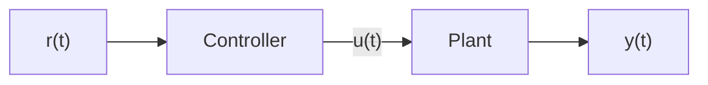
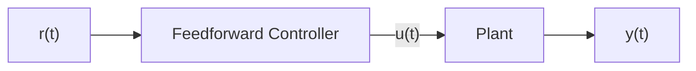
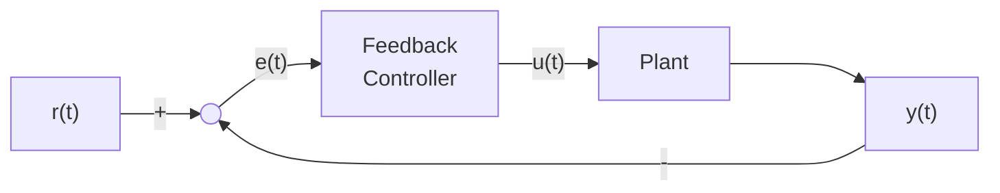

# Intorduction to Control Theory

> "Control theory is a field of control engineering and applied mathematics that deals with the control of dynamical systems. The aim is to develop a model or algorithm governing the application of system inputs to drive the system to a desired state, while minimizing any delay, overshoot, or steady-state error and ensuring a level of control stability; often with the aim to achieve a degree of optimality." - Wikipedia, [Control Theory](https://en.wikipedia.org/wiki/Control_theory)

At its simplest, Control Theory is the practice of making systems(mechanisms in our case) behave the way you want them to.

Control systems are all around us and we interact with them daily. A small list of ones you may have seen includes heaters and air conditioners with thermostats, cruise control and the anti-lock braking system(ABS) on cars, and fan speed modulation on modern laptops. Control systems monitor or control the behavior of systems like these.

!!! note
    Some examples were taken from Tyler Veness's amazing book - [Controls Engineering In FRC](https://file.tavsys.net/control/controls-engineering-in-frc.pdf)

## Terminology

The system or collection of actuators being controlled by a control system is called the plant. A controller is used to drive the plant from its current state to some desired state(the reference).

We will use the following notations for clarity:

$$
\begin{array}{llll}
  r(t) & \text{reference} & u(t) & \text{control input} \\
  e(t) & \text{error} & y(t) & \text{output}
\end{array}
$$

### Reference

Also called "setpoint". This is the state that we desire achieve.

### Error

The diffrence between where we are now, and where we want to get(our reference). Can be also written like this:

$$
e(t) = r(t) - y(t)
$$

### Control Input

This is the force that the control system that we will model will apply.

### Output

The effect of our control input on the state of the system.

### Plant

The system being controlled by a control system is called the plant.

### Block Diagrams

These systems can be modeled in block diagrams, and we will do this throughout this guide.

---

In Control Theory, we have two types of control:

## Open Loop Control

The "blind" method.

An open loop system takes an input, does a preprogrammed action, and hopes for the best. It doesn't get feedback from sensors.

These are also called feedforward controllers.

As you can see from the diagram, a change in $y(t)$ doesn't effect our controller, as thus it is "blind".

## Closed Loop Control

A closed loop system measures its own output, compares it to what you asked for, and constantly tweaks its behavior to close the gap.

As you can see from the diagram, a change in $y(t)$ does effect our controller, and thus it will continue to tweak it's $u(t)$ until the reference is met.

----

In the next documents we will learn about the parts of the PID Controller, a common closed loop controller.