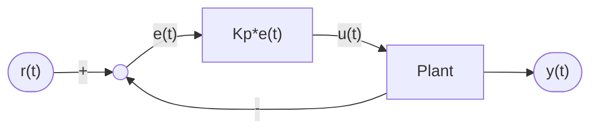
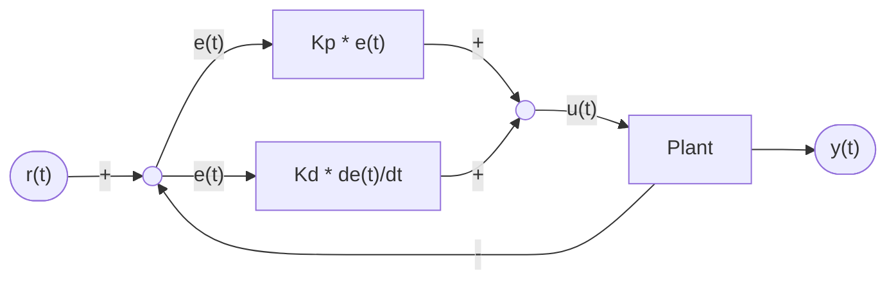
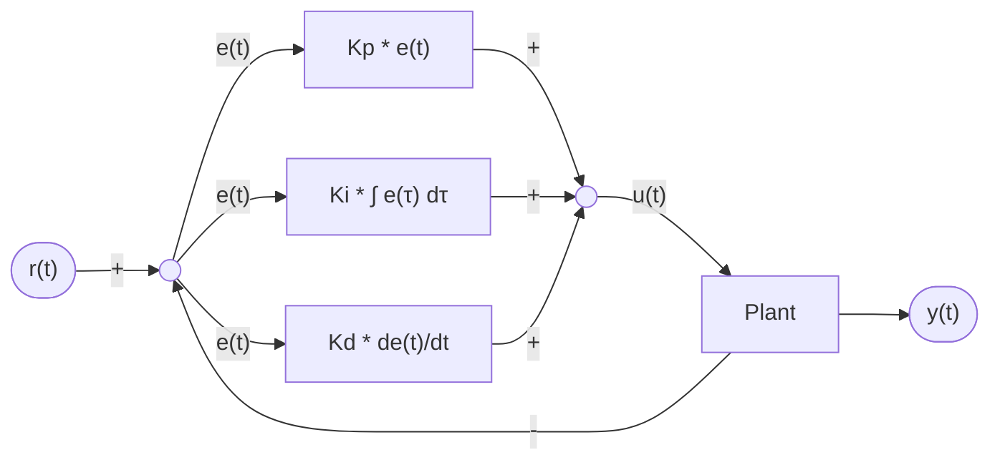

# What Is The PID Controller?

The PID controller is a commonly used closed-loop feedback controller.

It continuously calculates an error value and applies a corrective output to drive a system toward a target reference(setpoint).

PID stands for the three terms it consist of - Proportional, Integral, and Derivative.

In our field of robotics, a PID controller is widely used in everything, from getting an elevator to the desired state, to getting the swerve motors to the exact velocity needed.

## Formula

The formula for the PID controller may seem intimidating at first, but don't worry - we will go over each of the terms individually. It's not as scary as it may seem.

$$
u(t) = K_p e(t) + K_i \int_{0}^{t} e(\tau) d\tau + K_d \frac{de(t)}{dt}
$$

Where $u(t)$ is the control output, $e(t)$ is the current error ($e(t) = r(t) - y(t)$), and $K_p, K_i, K_d$ are the tuning gains.

Woah. That is some big math.

---

We'll start from the simplest term - the Proportional(P) term.

## The Proportional Term

The formula for a P controller is as follows:

$$
u(t) = K_p e(t)
$$

More manageable, right?

The Proportional term attempts to drive the position error to zero by contributing to the control signal proportionally to the current position error. Intuitively, this tries to move the output towards the reference.

We can think of the P controller like "software-defined springs" that pull the system toward the desired position.

If you learned physics, you may recall Hooke's law about springs:

$$
F = -kx
$$

we can also write this as $F = k(0-x)$ or $F(t) = k(r(t) - y(t))$. Notice how now this looks exactly like the formula for our P controller? Nice.

When the error is bigger(the desired position and the current position are further away), the force of the "spring" will be higher, when getting closer to the reference, the force will be lower.

We can also visualize it using a simple block diagram:

## The Derivative Term

The formula for the PD controller is as follows:

$$
u(t) = K_p e(t) + K_d \frac{de(t)}{dt}
$$

!!! tip
    This section requires a basic knowledge of what derivatives are, If you are completely new to this concept, [this video](https://www.youtube.com/watch?v=9vKqVkMQHKk) by 3Blue1Brown is great!

!!! note
    Here we use Leibniz's notation for derivatives($\frac{dy}{dt}$), you might know and use Lagrange's notation in school($y'(t)$). They are the same in meaning.

The Derivative term attempts to drive the derivative of the error to zero by contributing to the control signal proportionally to the derivative of the error.

Intuitively, this tries to make the output move at the same rate as the reference.

I think the derivative term can be better explained mathematically:

As we know, the derivative of the position(with respect to time) is velocity(with respect to time), and can be written like this:

$$
v(t) = \frac{dy(t)}{dt}
$$

But, because we are doing control on the error($e(t)$) instead of the position, it will look like this:

$$
u_D(t) = K_d(\frac{dr(t)}{dt} - \frac{dy(t)}{dt})
$$

We can cancel out the reference's derivative(we will assume it doesn't change for now), as the derivate of a constant is zero($\frac{dr(t)}{dt} = 0$).

$$
u_D(t) = K_d(0 - \frac{dy(t)}{dt}) = -K_D \frac{dy(t)}{dt}
$$

Now, as we established before, the velocity is the derivative of the position:

$$
v(t) = \frac{dy(t)}{dt}
$$

Substitute $v(t)$ in:

$$
u_D(t) = -K_d v(t)
$$

We can now really understand this term, it dampens the system's own "momentum".
Where the proportional term acts as a virtual spring - pulling the system toward the target with a force based on the error's magnitude.

The derivative term acts as a "shock absorber". It does not care where the system is. It cares only how fast it is moving.
By having a term proportional to velocity, and opposite, it absorbs overshooting that the proportional term might have.

We can visualize the PD controller in a block diagram:

## The Integral Term

!!! warning
    Integral control is generally not recommended for use in FRC. It is almost always better to use a feedforward controller to eliminate steady state error.

The formula for the PI controller is as follows:

$$
u(t) = K_p e(t) +  K_i \int_{0}^{t} e(\tau) d\tau
$$

> The integral integrates from time 0 to the current time $t$. We use $\tau$ for the integration because we need a variable to take on multiple values throughout the integral, but we can't use $t$ because we already defined that as the current time.

When the system is close to the setpoint, the proportional term may be too small to pull the output all the way to the setpoint, and the derivative term will be zero in that case.
This can result in something called steady-state error, where the proportional term is not "strong" enough to pull the error to exactly zero, leaving a small error remaining.

In that case, we can integrate the error from time zero to $t$, and add it to the control output. That way, with time, the control output will rise until the error is exactly zero.

We can model the PI controller with a block diagram as well:

## The Complete PID Controller

Now that we understand every term of the PID Controller, we can look again at it's mathematical and visual representations:

$$
u(t) = K_p e(t) + K_i \int_{0}^{t} e(\tau) d\tau + K_d \frac{de(t)}{dt}
$$

And by a block diagram:

We can eliminate one of the terms by setting their respective constant to zero. If we wanted just a PD controller, we can just set $K_i = 0$.

!!! tip
    I also highly recommend watching [this video](https://www.youtube.com/watch?v=UOuRx9Ujsog) by Professor Dmitry Berenson, which explains PID control.

---

In the next document we will discover the feedforward controller and how we can incorporate it with our PID controller for even better control.