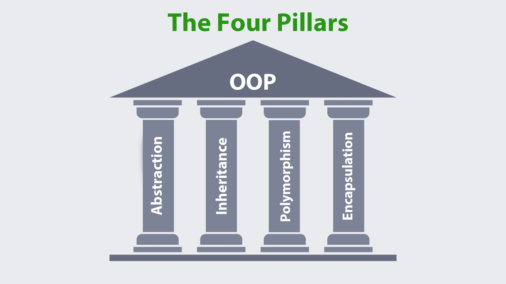

# Introduction to OOP
> "Object-oriented programming (OOP) is a programming paradigm based on objects - software entities that encapsulate data and function(s). An OOP computer program consists of objects that interact with one another." - Wikipedia, [Object-oriented programming](https://en.wikipedia.org/wiki/Object-oriented_programming)

Up to now, we learned how to structure our programs by seperating our tasks into methods that do one specific thing. Now, we are going to shift our mindset to think of everything more like the real world.

In the real world, everything we interact with is an object. Whether it's the computer or phone you are currently using, a dog, a person, or a coffee.
Every real world object around us has two important things:

1. **Properties**: What the object has. For a car, the properties may include its color, brand, and current speed, for example.

2. **Behaviour(Methods)**: What the object can do. For the car, the behaviors may include moving forward, braking, or honking.

In Object-Oriented Programming, instead of just writing a top to bottom list of actions or methods, we are now going to write our data and our actions together inside objects.

In this document, we'll learn about what each term in OOP mean, and in later documents we will start implementing this knowledge in Java!

## Terms

### The Class

This is the blueprint(mold) for the object! Here we specify what our object can have and do.
For the car example: We have a lot of diffrent car types, but they all share common properties, like the color, brand, current speed, etc... and common actions like moving, braking, and honking.

We define these properties and actions in the blueprint(called "Class"), and then we can make as many objects with diffrent values to these properties.

Instead of writing the code for these properties and actions over and over again from scratch, we define them once inside a class.

### The Object
Once we have our blueprint(the class), we can use it to make actual objects(called "Instances").

Because the class defined our "mold", we can make out as many unique car objects as we need. They will all share the same structure we defined in the class, but we can assign different values to their properties, and call their actions:

* **Object 1**: A red Ferrari currently going 80 km/h.

* **Object 2**: A silver Mazda currently going at 0 km/h.

* **Object 3**: A blue Ford currently going at 45 km/h.

Even though they look different and have different speeds, they were all built using our single Car class.

## The 4 Pillars of OOP
In Object-Oriented Programming we have 4 pillars - Encapsulation, Inheritance, Polymorphism, and Abstraction.
In this section we'll only talk about Encapsulation and Abstraction, and leave the remaining two to later on.

<figure markdown="span">
  
<figcaption>The 4 Pillars of OOP, taken from <a href="https://www.harisandcoacademy.com/blog/what-are-the-four-pillars-of-oops">an HACA article</a></figcaption>
</figure>

### Encapsulation
Imagine a capsule carrying a number of medicines.
You take the capsule, sure that it will cure the problem without having any understanding of the chemical composition or how the chemicals interact within.
This is the base of OOP encapsulation.

It is the process of combining data(properties) and the methods that interact with it into a single class.

Data hiding is the main objective of encapsulation.
To block direct access from outside the class, data members can be set to private.
As a result, public methods known as "getters" (for obtaining data) and "setters"(for changing data) are used to allow access.
This restricted access guarantees that all data will remain valid and prevents unwanted modifications.

#### Example

Consider a class called Bank Accounts. It might have a balance attribute. Without encapsulation, any component of your program could change the balance, ultimately leading to errors and problems.
When implementing encapsulation the balance is private, but public methods such as deposit amount and withdrawal amount are available. These techniques use verification logic to maintain the security of the bank account’s state like preventing negative withdrawals.

In simple terms, encapsulation promotes flexibility and security. Each object becomes a self contained unit that manages its own state and behavior making the code simpler to understand, maintain and diagnose when having problems.

> It's worth mentioning that encapsulation is more of a "mindset" than a feature in Java. When creating classes we should have in mind how we can keep this principle.

### Abstraction

Abstraction is about **what** an object does without going into depth about **how** it does it.

Think about driving a car, you control the car by using the steering wheel, accelerator and brakes. Driving properly does not need knowledge of the complicated elements of the engine like gearbox or braking system. This is an example of abstraction in action.

In programming, abstraction means providing only the basic properties of an object to the outside world while hiding the complex details of implementation.
It allows developers to focus on architectual design of the code and methods rather than falling down in unrelated details.

Abstraction reduces complexity, increases clarity and makes systems easier to maintain.
