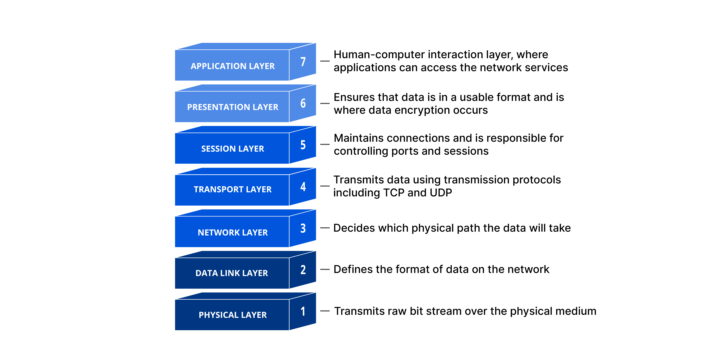
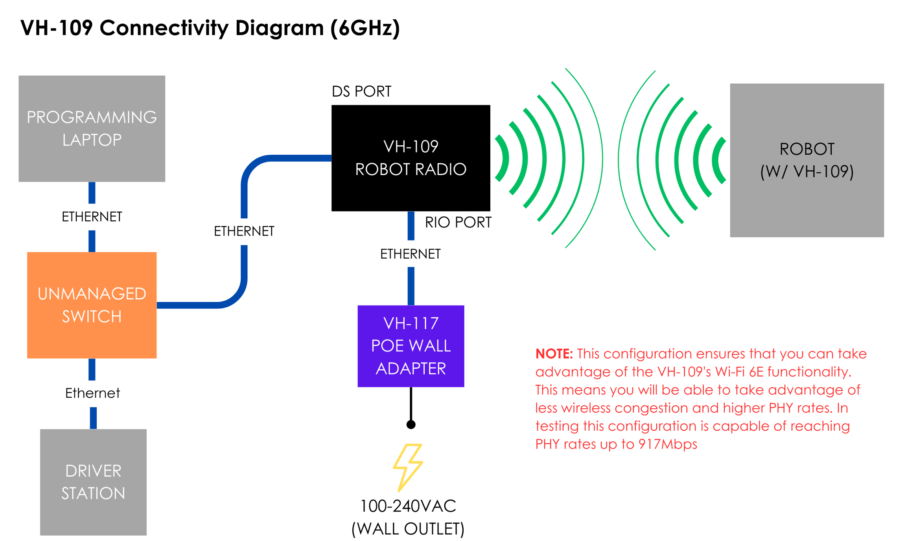

# Introduction to Networking

Computer networking connects multiple computing devices(like computers, servers, and mobile phones) to enable the sharing of data between devices.

In FRC, we use networks to enable communication between our processor(RoboRIO or SystemCore) to our Driver Station, Co-processors, etc...

## The OSI Model

The OSI model is a conceptual model created for different computer systems to be able to communicate with each other.

The OSI Model can be seen as a universal language for computer networking. It is based on the concept of splitting up a communication system into seven abstract layers, each one stacked upon the last.

It has 7 layers - physical, data link, network, transport, session, presentation and application



Each layer of the OSI Model handles a specific job and communicates with the layers above and below itself.

We won't go into much detail on the OSI model as it doesn't concern us much, but you are welcome to read about it [here](https://www.cloudflare.com/learning/ddos/glossary/open-systems-interconnection-model-osi/).

## Network Devices We Have

Before going into detail, we will introduce the networking components that we have:

* **VH-109 Radio**: The device responsible for the communication between our Driver Station and the robot.

* **RoboRIO/SystemCore**: Our robot controller - what our code runs on.

* **Co-Processors**: Additional processors, usually for vision.

In order for our robot to work, we need to have everything communicating smoothly.

## What is a network

Simply defined, a network is a connection of two or more devices together, such that they can exchange information.

The internet is an example of a 
network, so is the network you
have at home. In this case, your 
LAN at home is connected to the
massive WAN that is the internet.
A LAN is created by a router. In our
case, the radio is the router.

## IP Addresses

Basically, an IP address is the unique identifier for a computer on a network. An IP address allows other computers to talk to another computer. 

Think of it as an house address, but for your computer. Someone needs an address to get to your house, so do other computers on a network.

In FRC, every device on our network has the following IP address subnet(schema):
```
10.TE.AM.DEVICE
```

For example, The radio of team 5987 will have the following IP address:
```
10.59.87.1
```

A co-processor for example may be connected on:
```
10.59.87.10
```

### Good IP Addresses to Know

Some of our devices have fixed(static) IP Addresses, these are some good to know ones:

* Robot Radio - `10.59.87.1`

* Driver Station Radio - `10.59.87.4`

* RoboRIO/SystemCore - `10.59.87.2`

Everything else can have whatever IP address you like.

## Radio

We have two radios in our setup, one is on the robot, providing it's network(the router).
And one in the Driver Station, connecting our laptop to the robot's network.

In order that both radios communicate with each other, they need to share a secret(a password).

This is done by configuring the radio and providing it with a WPA key(our network password).

## Setup Diagram

