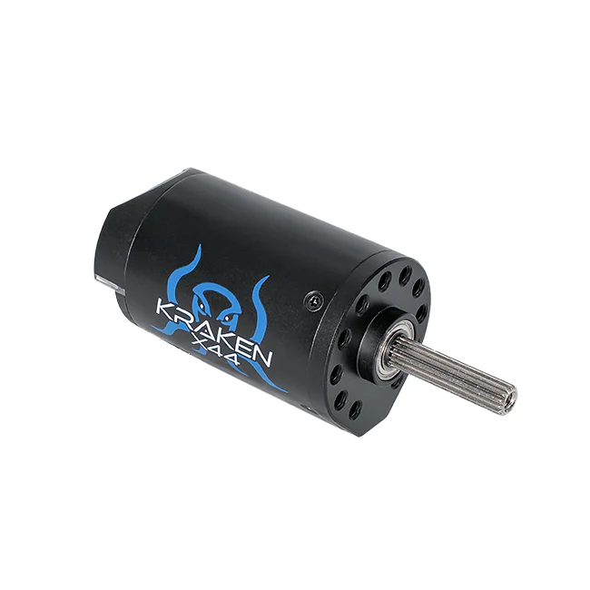
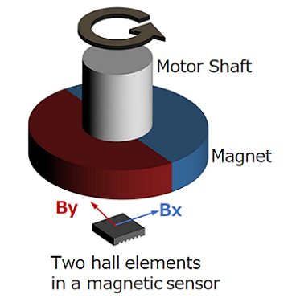
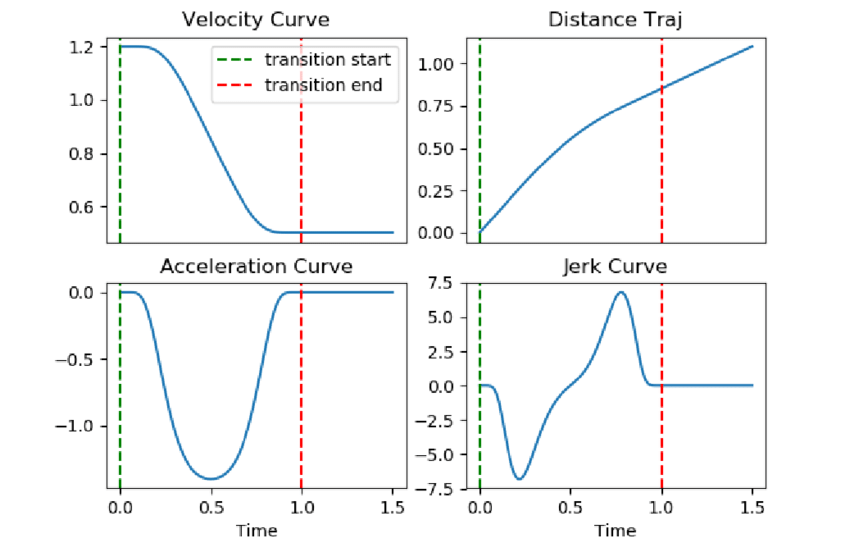

# Motors

> The motors showcased in the document are actually part of the Phoenix vendordep, and not WPILib.

Motors are the way our robot interacts with the world! These are extremely important, and we need to know to control them well.

## Our motor and it's components

We commonly use the [Kraken X44 or X60](https://wcproducts.com/products/kraken) motors produced by WCP.

These are Brushless DC motors, with a built in rotary magnetic encoder and a controller, we will go over each part, and understand it.

> There are a lot more motors that are allowed to use in FRC, this guide will only cover TalonFX motors like the Kraken.



### Brushless DC motor(BLDC)

This is the actual motor that does the work! 

The name(Brushless) comes from the motor's internal structure, which doesn't contain "brushes", unlike a brushed DC motor. We will not go into detail on diffrence between them, just know that BLDC motors are extremely powerful, but harder to control than a simple brushed DC motor. You can read more about this [here](https://www.renesas.com/en/support/engineer-school/brushless-dc-motor-01-overview).

### Rotary Magnetic Encoder

This is a sensor baked into our motor that count how much the motor has turned, this is done via a magnet. You can read more about how it's done exactly [here](https://en.wikipedia.org/wiki/Rotary_encoder).



The encoder provides us with positional data of how much the motor has turned(in degress, for example). But, we can also infer the current velocity of the motor, by using [numerical differentiation in discrete time](https://en.wikipedia.org/wiki/Numerical_differentiation).



### Controller

Aside from the BLDC motor driver, that is needed in order to control the motor, we also have a small microcontroller inside the motor.

It's sole task is to communicate with the main controller(Our RoboRIO/SystemCore) and send signals to the motor. It has control algorithms baked in, and can control our motor using feedback from our rotary encoder.

We communicate with this controller over the [CANBus](https://en.wikipedia.org/wiki/CAN_bus).

---

After understanding every aspect of our motor, we can finally see how we represent it in software.

## Controlling our motor in software

Like everything in software, we have abstractions for controlling our motors. We represent our motors as objects.

For this, we use the Phoenix 6 library(also called a vendordep). A more detailed documentation can be found [here](https://v6.docs.ctr-electronics.com/en/stable/docs/api-reference/api-usage/api-overview.html).

### Creating the motor object

=== "Kotlin"

    ```kotlin
    val motor: TalonFX = TalonFX(0)
    ```

=== "Java"

    ```java
    TalonFX motor = new TalonFX(0);
    ```

We create a new object of type `TalonFX`, that is on the default CANBus, and has id `0`.

### Configuration

The biggest advantage that TalonFX motors have are their huge configuration options.

We do this by creating a configuration object, and apply it to our motor object.

=== "Kotlin"

    ```kotlin
    val motor: TalonFX = TalonFX(0)
    val configuration = TalonFXConfiguration().apply { 
        // We commonly use scope functions for configuring motors, it makes it much easier!
        MotorOutput = MotorOutputConfigs().apply {
                NeutralMode = NeutralModeValue.Coast
                Inverted = InvertedValue.CounterClockwise_Positive
            }

        CurrentLimits = CurrentLimitsConfigs().apply {
            StatorCurrentLimitEnable = true
            StatorCurrentLimit = 30.0
        }
    }
    motor.configurator.apply(configuration)
    ```

=== "Java"

    ```java
    // TODO
    ```

We have a ton of configuration options for our motor, every option we don't set stays at default value. Check all of the available options [here](https://api.ctr-electronics.com/phoenix6/stable/java/com/ctre/phoenix6/configs/package-summary.html).

### Control Requests

After configuring the motor how we need it, we can run it by using control requests.

We have a bunch of control request types, we will go over the more advanced ones later. For now, we will use the `VoltageOut` request, which runs the motor at a specified voltage.
=== "Kotlin"

    ```kotlin
    val voltageRequest = VoltageOut(0.0)
    motor.setControl(voltageRequest.withOutput(5.0)) // sets the motor to 5 volts
    ```

=== "Java"

    ```java
    // TODO
    ```

This will spin the motor at 5 volts until we tell it otherwise.

We can then stop the motor by providing it with a 0 volt control request:

=== "Kotlin"
    
    ```kotlin
    motor.setControl(voltageRequest.withOutput(0.0))
    ```

=== "Java"

    ```java
    // TODO
    ```

> A list of all control requests can be found [here](https://api.ctr-electronics.com/phoenix6/stable/java/com/ctre/phoenix6/controls/package-summary.html)