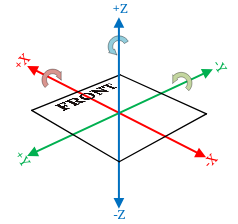

# Coordinate System

Coordinate systems are used widely. Our vision system can find it's pose in the field, but without having a coordinate system, we can't place it.

## WPILib coordinate system

There isn't much to say, this is the WPILib coordinate system that we use. It can seem a bit unnatural at first, you will get used to it.

{.white-bg}